This is a [Next.js](https://nextjs.org/) project bootstrapped with [`create-next-app`](https://github.com/vercel/next.js/tree/canary/packages/create-next-app).

## Getting Started

First, run the development server:

```bash
npm run dev
# or
yarn dev
# or
pnpm dev
# or
bun dev
```

Open [http://localhost:3000](http://localhost:3000) with your browser to see the result.

You can start editing the page by modifying `app/page.tsx`. The page auto-updates as you edit the file.

This project uses [`next/font`](https://nextjs.org/docs/basic-features/font-optimization) to automatically optimize and load Inter, a custom Google Font.

## Learn More

To learn more about Next.js, take a look at the following resources:

- [Next.js Documentation](https://nextjs.org/docs) - learn about Next.js features and API.
- [Learn Next.js](https://nextjs.org/learn) - an interactive Next.js tutorial.

You can check out ![the Next.js GitHub repository]

## Deployment: Not logged in

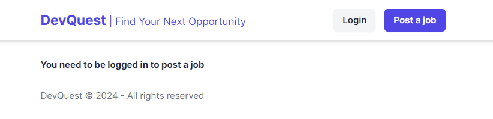

When a new user/logged out user opens the page, it shows recent jobs ordered based on date posted.


User needs to be logged in to post a job. However an user does not need to be logged in to view the job description and application details

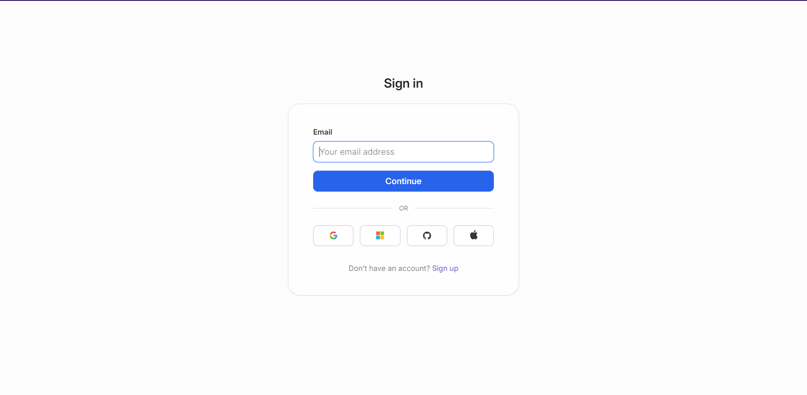
Sign in page that appears when Login is clicked. User can also login through Gmail and other services. Security and structure of this page is maintained by WorkOS. It is used to keep track of users and privileges.

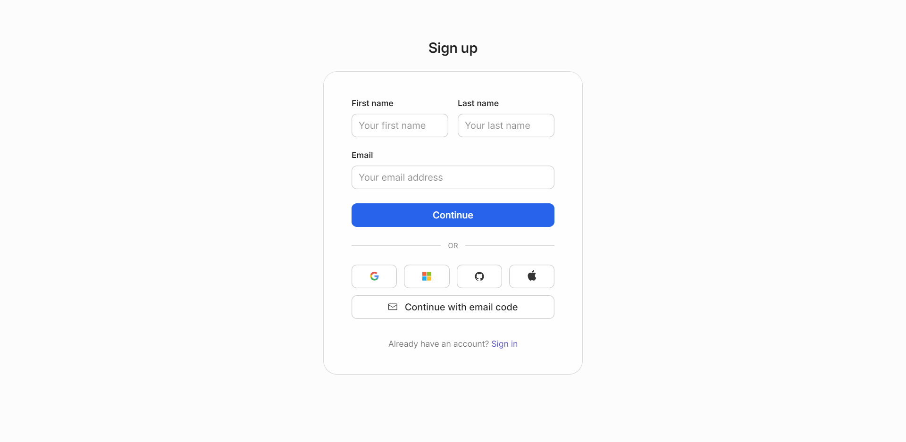

Sign up page for creating an account. 


When a job title from a listing is clicked, the user is redirected to this page, where they can access the job description and contact information. Login not required


## Deployment: Logged in 

Home page of a logged in user shows recent jobs along with the option to edit and delete jobs posted by the said user. User's permission to edit and delete is stored in MongoDB where it indicates whether they are the creator of a job.

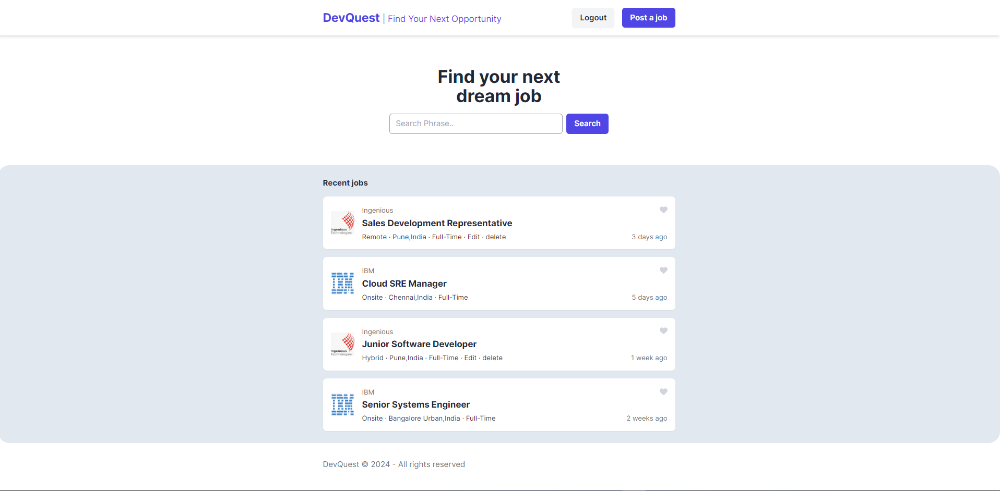

When a new user/ user without added companies clicks on 'Post Job', this page appears, urging the user to add companies to create listings for.

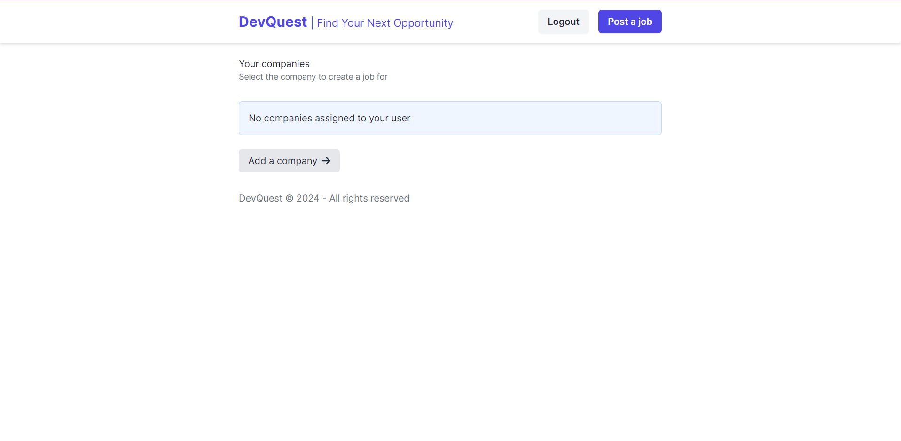

When Add a company is clicked, user is redirect to this page.

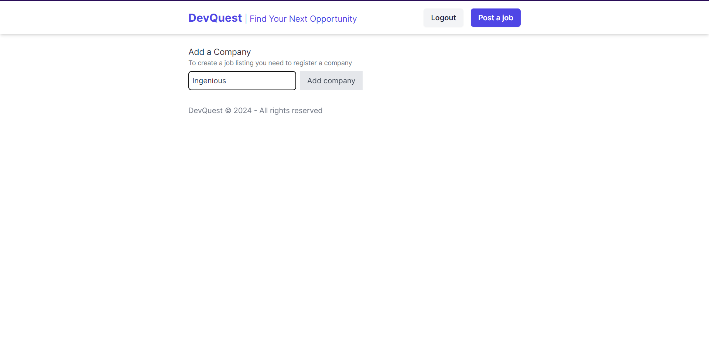

After user adds company, they can proceed to create job listings.

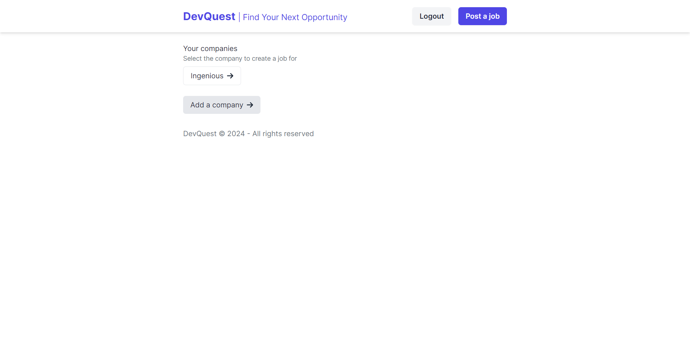

When a company to create for is selected, user is redirected to this form. 

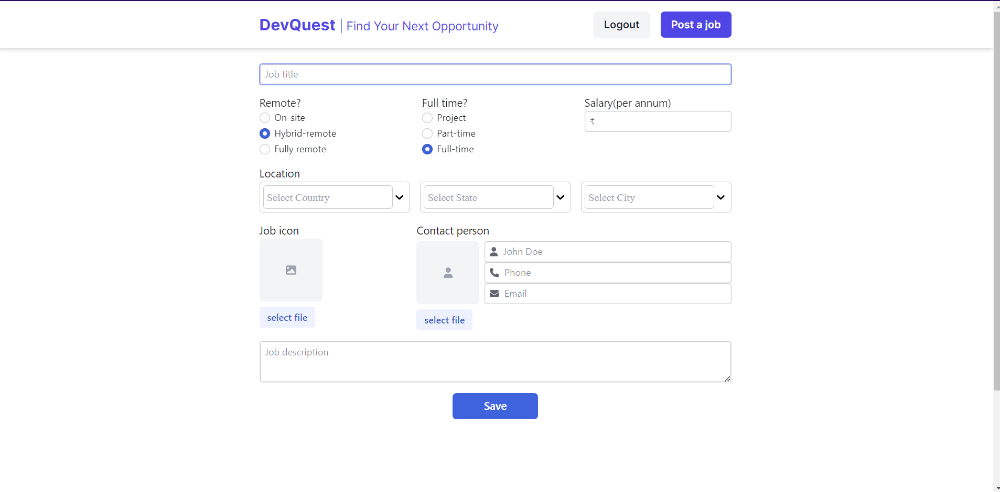

This is what a filled form looks like. The description page is created based on this form. 

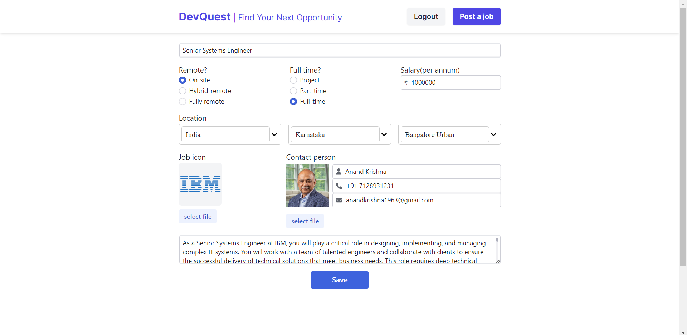


Lets edit save this and edit it. The user is redirected to the same form page and the already added information is pulled from MongoDB to make it available for editing

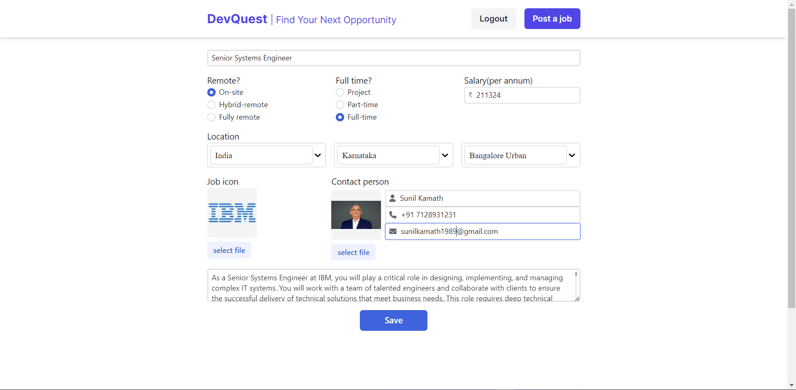

Let's change the contact information alone and check for changes in the description page.

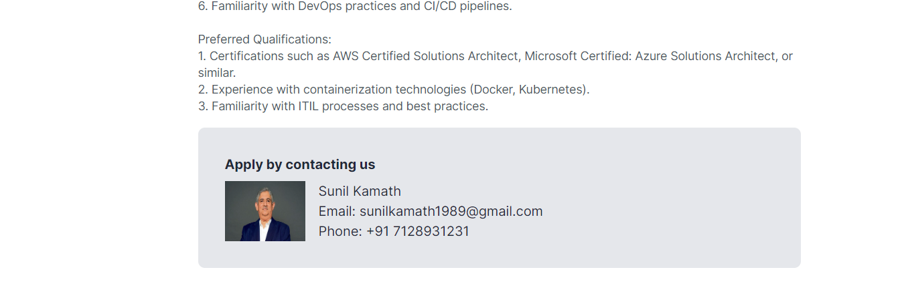

Voilà! The changes are made automatically in the description page.

When a job is posted by a user, they are redirected to this page, which shows the list of jobs posted by them.

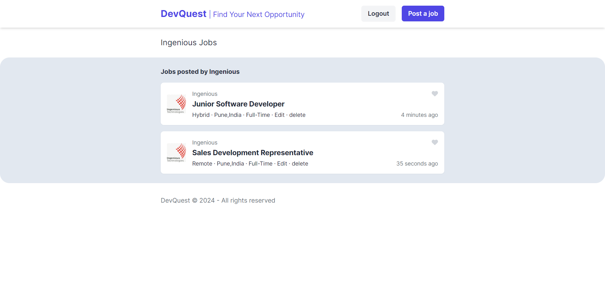

This page can also be accesssed by clicking ont he company name in the home page. 

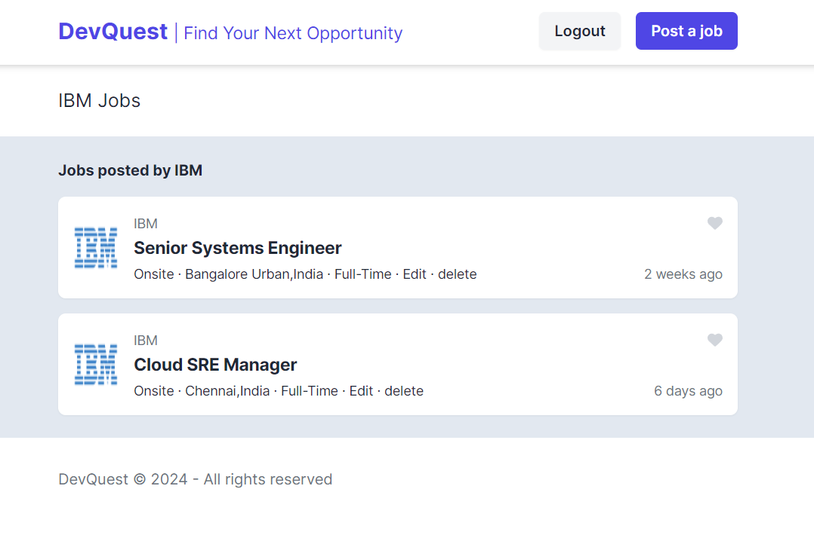

The user needs to be neither the poster nor logged in to view the jobs posted by a selected company.

Aside from editing, the job creator is given the option to delete the job they posted. This is done by simpling clicking the delete button. Let's delete the most recent job.

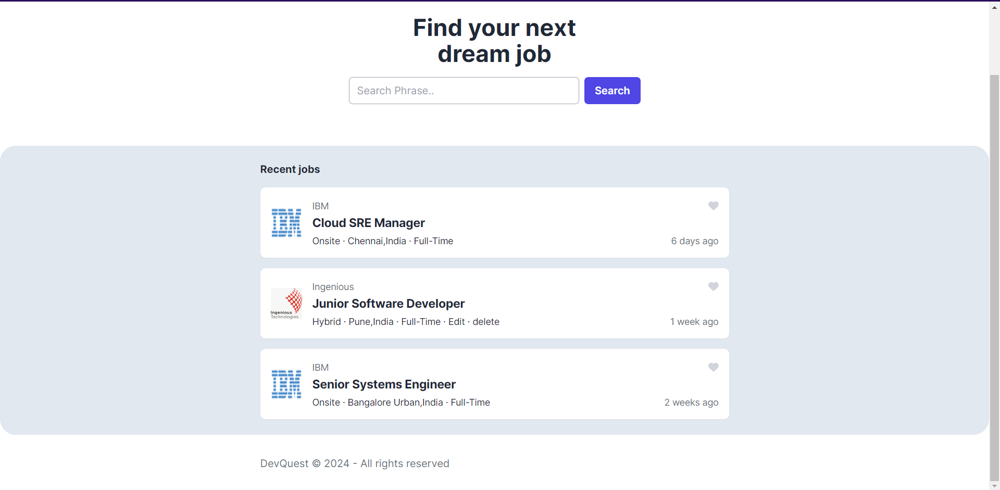

The job is promptly removed from the job list and the database. Only the other jobs are visible now.